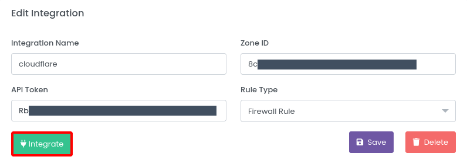

# Configure Integration and Trigger Rule

When a Suspect detected, you can get an action manually, but this is useless. For this, we developed Trigger and Integration mechanisms. Basically, Triggers are set of rules. Integrations are actions when a Trigger Rule is triggered. For example, you create an Email Integration, and you create a Trigger Rule. When a Suspect detected and this Trigger Rule triggered, you get an email about this Suspect.

## Create Integration

To create an Integration, go to ``Integrations > Create New Integration``

Then, select an Integration type.

### Notification Integrations

**Notification** Integrations are pasive integrations. For example, when a Suspect detected, Slack Integration sends a message to Slack channel.

Select a Notification Integration (e.g. Slack) and create an Integration. After creation, you must verify it. Visit the Integration detail page and click the **Integrate** button. 

If successfully integrated, you can start using it. 

### Incident Response Integrations

**Incident Response** integrations are active Integrations. For example, when a Suspect detected, Cloudflare Integration block this Suspect.

Select a Incident Response Integration (e.g. Cloudflare) and create an Integration. After creation, you must verify it. Visit the Integration detail page and click the **Integrate** button. 

First of all, create a custom Cloudflare API token from [Cloudflare Dashboard](https://dash.cloudflare.com/profile/api-tokens) with Zone Firewall Edit permission.

Secondly, create a Cloudflare Integration with this API token and your Cloudflare Zone ID.

Lastly, verify the Integration from Integration detail page.

## Create Trigger Rule

To create a Trigger Rule, go to ``Triggers > Create New Trigger``

Then, set a trigger rule and select an Integration. 

Now, when this Trigger Rule is triggered, selected Integration will execute.

Or, if you create a Trigger with an Incident Response Integration, detected suspect will block.

