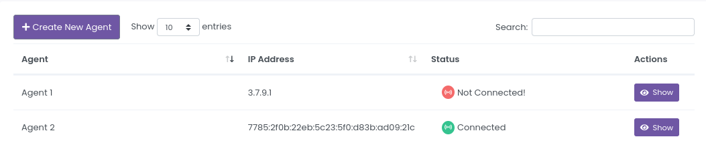
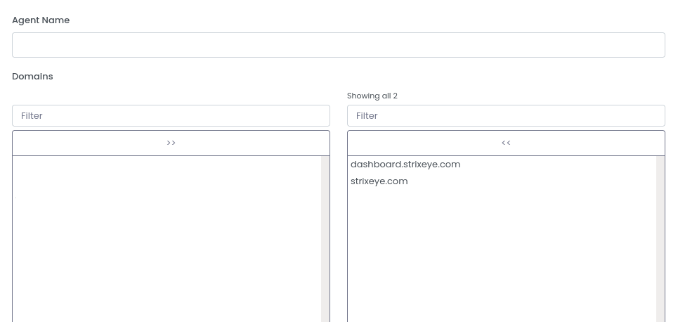
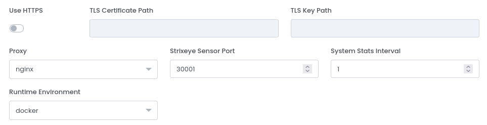
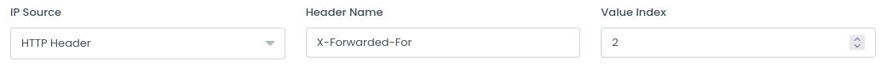
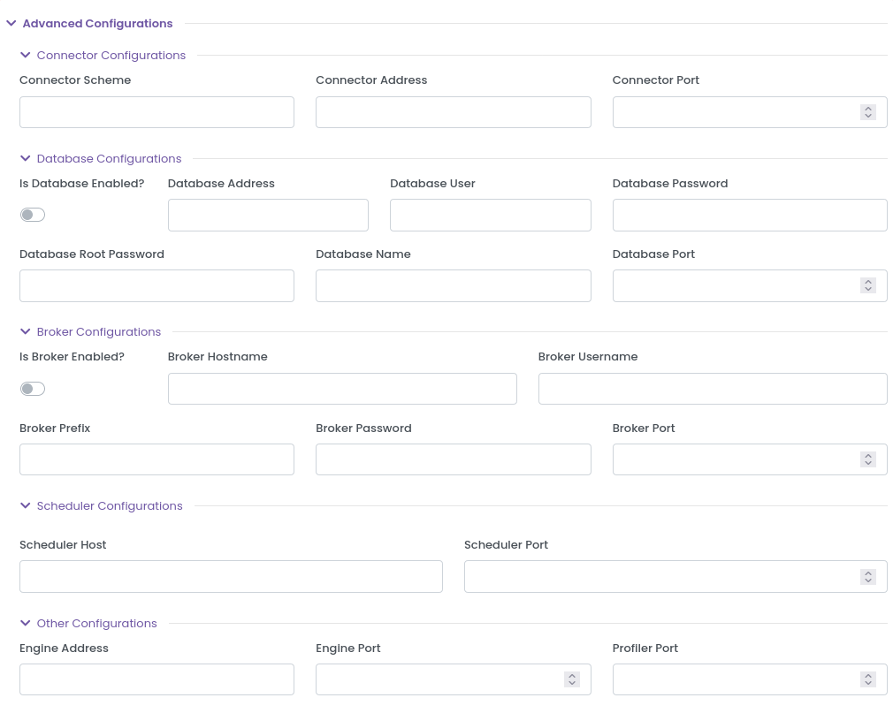

# Agents

You can see all Agents on the [Agents](https://dashboard.strixeye.com/agents){:target="_blank"} page.

## Create Agent

Before installing StrixEye Agent to your server, you must first create an Agent from Dashboard.

Give a name and select Domains that you want to analyzing with the new Agent. Each Agent must have at least one Domain. You can add multiple Domains to an Agent.

## Agent Details

### Agent Statistics Chart

Top of the page, you can see Agent's status and live statistics if Agent alive. 

This card's header shows the Agent's name, Agent's IP address and Agent's status. The graph on the left shows the current CPU usage. The graph next to it shows the current RAM usage. The request chart shows the number of current requests received by the agent. And the graph on the right shows how many unique visitors were analyzed at the moment.

### Edit Agent

**Edit Agent** card is the same as the **Create Agent** page above. You can change Agent name, domains or Agent configurations. If you edit an Agent, it will be restarted. **So, you may lose requests that have not yet been analyzed!**

## Agent Configurations

If you want to mirror over HTTPS, you need to turn on the **Use HTTPS** switch and then give the TLS certificate and TLS key paths.

**Strixeye Sensor Port** field specifies which port will use by StrixEye. And it is the port that you must mirror the requests.

**System Stats Interval** field specifies how often you want to send system statistics. 

**IP Source** field specifies the how send the original request's IP address to the Agent. It takes 2 value, *TCP Source Flag* and *HTTP Header*. If you send the original IP address in TCP packet, you must select *TCP Source Flag*. If you send the original IP address in HTTP header, you must select *HTTP Header* and you must set the *Header Name* and *Value Index*.

For example, you send the original IP address in HTTP Heeder with X-Forwarded-For with multiple IP and original IP is 3th one, you can do like this:

**Port Source** field specifies the how send the original request's port to the Agent. It takes 2 value, *TCP Source Flag* and *HTTP Header*. If you send the original Port in TCP packet, you must select *TCP Source Flag*. If you send the original Port in HTTP header, you must select *HTTP Header* and you must set the *Header Name* and *Value Index*.

**Runtime Environment** field specifies which runtime environment you want to use. We only support Docker and Kubernetes for now. If you want to use Kubernetes, you can use your own config file.

## Agent Advanced Configurations

Advanced Configurations related to the internal mechanism of Agent. On the create page, they are all empty values. If you do not set any values, they will take default values. **We do not recommend changing the advanced configurations. Please do not change the advanced configurations if you do not know what you are doing!**

### Connector Configurations

**Connector Scheme** field specifies how the agent connecting to the Connector. It takes *ws* or *wss* values.

**Connector Address** field specifies the address of the Connector.

**Connector Port** field specifies the port of the Connector.

### Database Configurations

**Is Database Enabled** field specifies whether or not the database is enabled. If you don't want to StrixEye's own database, you can turn off this field.

**Database Address** field specifies the address of the Database.

**Database User** field specifies the user of the Database.

**Database Password** field specifies the password of the Database.

**Database Root Password** field specifies the root password of the Database.

**Database Name** field specifies the name of the Database.

**Database Port** field specifies the port of the Database.

### Broker Configurations

Broker is a RabbitMQ container that improves the performance of the Agent.

**Is Broker Enabled** field specifies whether or not the broker is enabled.

**Broker Hostname** field specifies the host of the Broker.

**Broker Username** field specifies the username of the Broker.

**Broker Prefix** field specifies the protocol of the Broker. You can access supported protocols [here](https://www.rabbitmq.com/protocols.html)

**Broker Password** field specifies the password of the Broker.

**Broker Port** field specifies the port of the Broker.

### Scheduler Configurations

**Scheduler Host** field specifies the host of the Scheduler.

**Scheduler Port** field specifies the port the Scheduler.

### Other Configurations

**Engine Address** field specifies the address of the Engine.

**Engine Port** field specifies the port of the Engine.

**Profiler Port** field specifies the port of the Profiler.