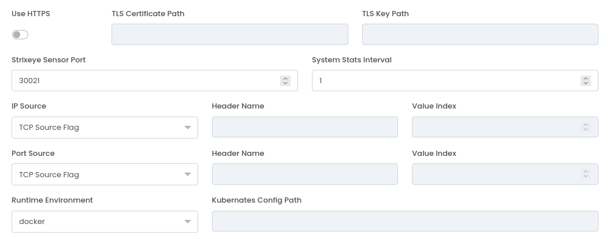

# Agents

You can access the Agents page [here](https://dashboard.strixeye.com/agents){:target="_blank"}.

## Create a new Agent

Before installing StrixEye Agent to your server, you must first create an Agent from Dashboard.

Give a name and select Domains that you want to analyzing with the new Agent. Each Agent must have at least one Domain. You can add multiple Domains to an Agent.

### Agent Configurations

If you want to mirror over HTTPS, you need to turn on the **Use HTTPS** switch and then give the TLS certificate and TLS key paths.

**Proxy** field specifies which software to use for the mirroring. For example, if you use Nginx as load balancer or reverse proxy, you must select Nginx. 

**Strixeye Agent Port** field specifies which port will use by StrixEye. And it is the port that you must mirror the requests.

**System Stats Interval** field specifies how often you want to send system statistics. 

**Runtime Environment** field specifies which runtime environment you want to use. We only support Docker and Kubernetes for now. If you want to use Kubernetes, you can use your own config file.

## Agent Detail Page

### Agent Statistics Chart

Top of the page, you can see Agent's status and live statistics if Agent alive. 

This card's header shows the Agent's name, Agent's IP address and Agent's status. The graph on the left shows the current CPU usage. The graph next to it shows the current RAM usage. The request chart shows the number of current requests received by the agent. And the graph on the right shows how many unique visitors were analyzed at the moment.

### Edit Agent

**Edit Agent** card is the same as the **Create Agent** page above. You can change Agent name, domains or Agent configurations. If you edit an Agent, it will be restarted. **So, you may lose requests that have not yet been analyzed!**

