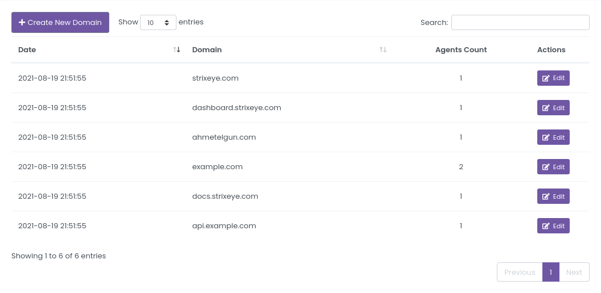
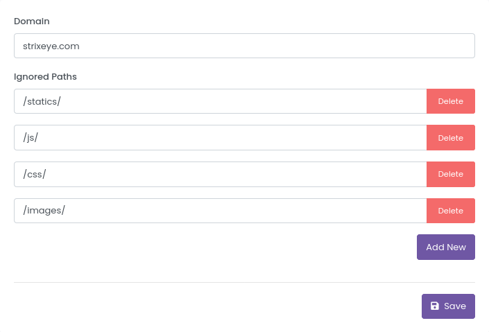
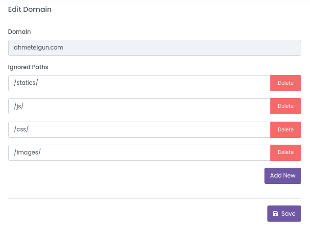
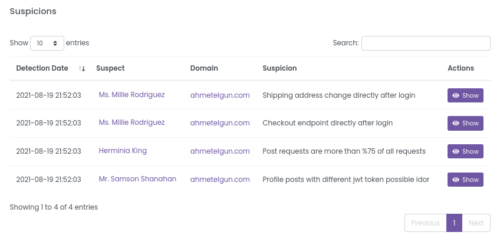

# Domains

Agents group requests according to domains while performing analysis. So each agent needs at least one domain.

You can access the Domains page [here](https://dashboard.strixeye.com/domains){:target="_blank"}.

## Create
You can create a new domain in [Domain Create page](https://dashboard.strixeye.com/domains/create/){:target="_blank"}

**Ignored Endpoints** fields allow you to filter requests from that domain. For example, if you don't want to analyze all requests under ``/statics/`` path, you can add ``/statics/`` paths to ``Ignored Paths`` fields. There may be some predefined paths, be careful when creating a domain.

## Edit

In Domain edit page, you can edit Domain's ``Ignored Paths`` fields but you can not edit the Domain name. If you want to edit Domain, you should delete the Domain and recreate it.

At the bottom of the domain edit page, you can see the suspicions detected in the domain.

