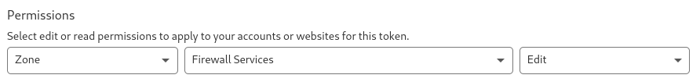

# Integrations

You can see all Integrations on the [Domains](https://dashboard.strixeye.com/integrations){:target="_blank"} page.

## Create Integration

You can create a new Integration in [Integration Create page](https://dashboard.strixeye.com/integrations/create/){:target="_blank"}

We support two types of integrations: **Notification Integration** and **Incident Response Integration**. Each Integration contains *Steps* in its create page.

**Each Integration must verified after creation. Visit the Integration detail page and click *Integrate* button for verification.**

### Incident Response Integrations

**Incident Response** integrations are active Integrations. For example, when a Suspect detected, Cloudflare Integration block this Suspect.

First of all, create a custom Cloudflare API token from [Cloudflare Dashboard](https://dash.cloudflare.com/profile/api-tokens){:target="_blank"} with Zone Firewall Edit permission.

Secondly, create a Cloudflare Integration with this API token and your Cloudflare Zone ID.

Lastly, verify the Integration from Integration detail page.

### Notification Integrations

**Notification** Integrations are pasive integrations. For example, when a Suspect detected, Slack Integration sends a message to Slack channel.

## Integration Details

You can display and edit Integration in Integration detail page.

### Edit Integration

Only Integration name changeable. 

