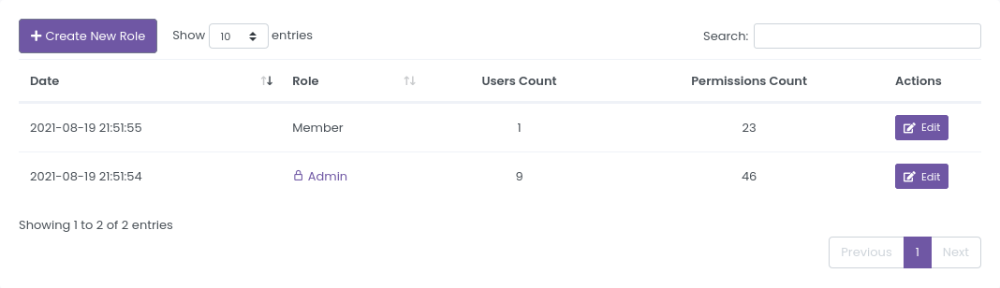

# Roles

Roles supports powerful permission system. 

You can see all Roles on the [Roles](https://dashboard.strixeye.com/roles){:target="_blank"} page.

**Admin** role is the default role the administrator. It has all permissions.

## Create Role

You can create a new Role in [Role Create page](https://dashboard.strixeye.com/roles/create/){:target="_blank"}

Permissions listed in severel title and each title contains multiple permission. Each permission independent of the other. For example, you may have Agent delete permission while you don't have permission to Agent view.

**index** permission is for listing elements. If you don't have agents.index permission, you can't list Agents.

**create** permission is for creating a element. If you don't have agents.create permission, you can't create new Agent.

**show** permission is to display the details. If you don't have agents.show permission, you can't display the Agent details.

**update** permission is for updating an element. If you don't have agents.update permission, you can't update an Agent.

**delete** permission is for deleting an element. If you don't have agents.delete permission, you can't delete an Agent.

## Role Details

You can edit or delete the Role on Role details page.

### Edit Role

