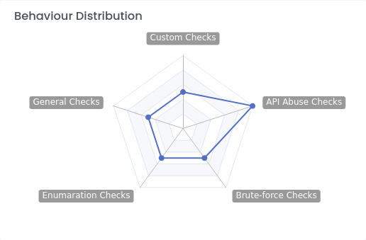

# Suspects

Our goal is to detect a Suspect from its behavior, even if it uses VPN, changes browser, changes IP, or uses Tor. 

You can see the all Suspects on [Suspects](https://dashboard.strixeye.com/suspects) page.

## Edit Name
Suspect names are randomly generated. If a suspect has caught your attention, you can change its name to make it easier to follow it.

## Risk Score
The Suspect's score is calculated based on its behavior and may change over time. The higher the score, the higher the probability of the suspect is attacker. 

## Behaviour Distribution

Behavior Distribution chart shows by which checks the Suspect was detected. 

## Domains

The Domain list shows in which domains the suspect was detected. If a Suspect is only interested in one of your domains, it may be looking for something only in that domain. If it is detected on all your domains, it may be scanning.

## IP Addresses

IP addresses show which IP addresses the Suspect is using. Even if the Suspect changes the IP address, StrixEye can detect it.

## Suspicions

The Suspicions table shows which attacks of the Suspect were detected.

