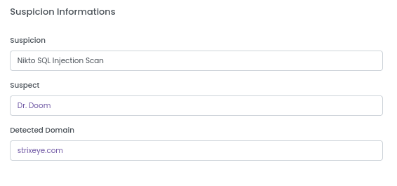

# Suspicions

Suspicious acts are an attempt to attack by a suspect. Each suspicion has a score and if a Suspicion detected, Suspect's score increased as Suspicion score. 

You can see all Suspicionson on the [Suspicions](https://dashboard.strixeye.com/suspicions) page.

## Suspicion Informations

Suspicion Informations card shows Suspicion type, Suspect and Detected Domain.

## Suspicion Steps

Suspicion Steps card shows how Suspicion happens. A step occurs when several static checks are triggered. After a few steps, a Suspcion occurs.

