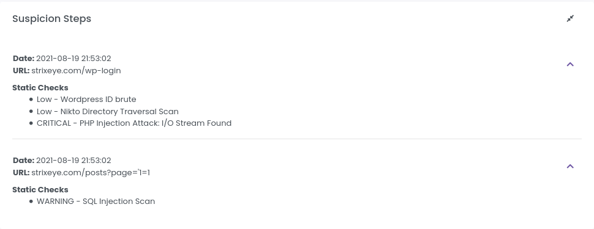

# Suspicions

Suspicious acts are an attempt to attack by a suspect. Each Suspicion has a score and if a Suspicion detected, Suspect's score increased as Suspicion score. 

You can see all Suspicions on the [Suspicions](https://dashboard.strixeye.com/suspicions){:target="_blank"} page.

## Suspicion Details

### Suspicion Informations

*Suspicion Informations* card shows Suspicion type, Suspect and Detected Domain.

### Suspicion Steps

Suspicion Steps card shows how Suspicion happens. A step occurs when several static checks are triggered.

