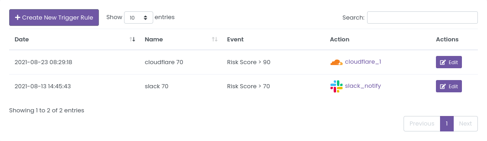
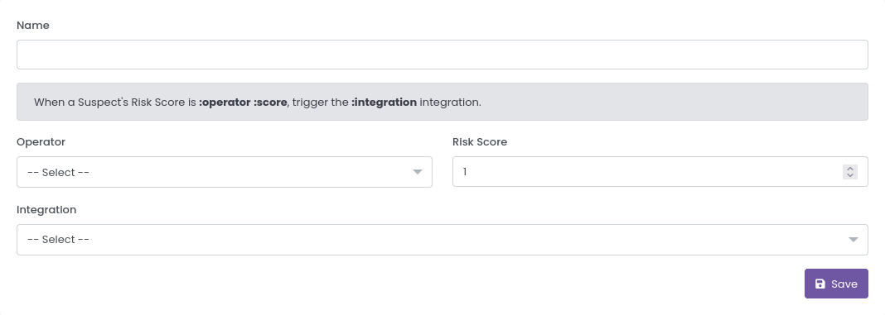
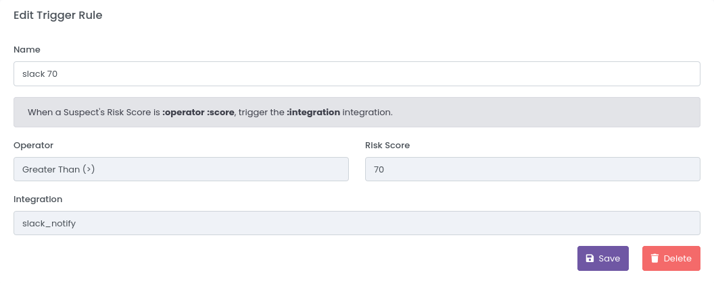
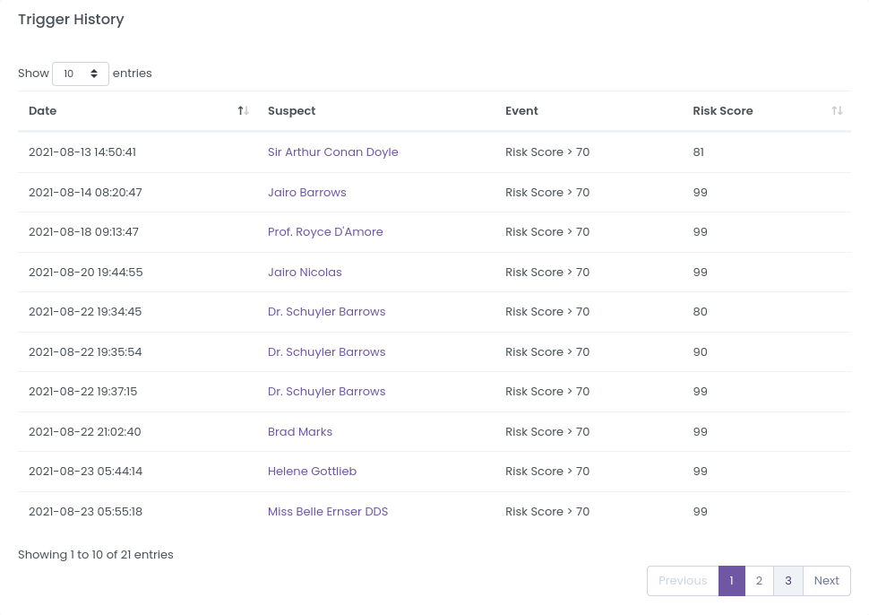

# Trigger Rules

You can access the Trigger Rules page [here](https://dashboard.strixeye.com/triggers){:target="_blank"}.

## Create Trigger Rule

You can create a new Trigger Rule in [Trigger Rule Create page](https://dashboard.strixeye.com/triggers/create/){:target="_blank"}

**Operator** and **Risk Score** define in which state the trigger will be triggered. If you choose *Greater Than* operator and 70 *Risk Score*, when a Suspect's score exceeds 70, it trigger.

**Integration** specifies what to do when the Trigger is triggered.

## Trigger Rule Details

You can display and edit Trigger Rules in Trigger Rule detail page.

### Edit Trigger Rule

You can change only Trigger Rule's name.

### Trigger Rule History

You can see all Trigger Rule history in Trigger Rule Detail page.