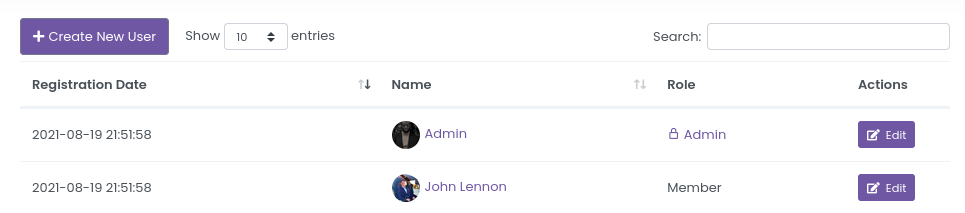
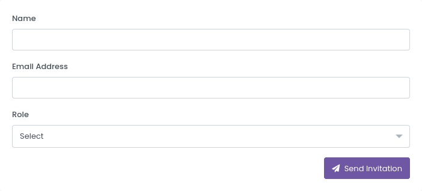
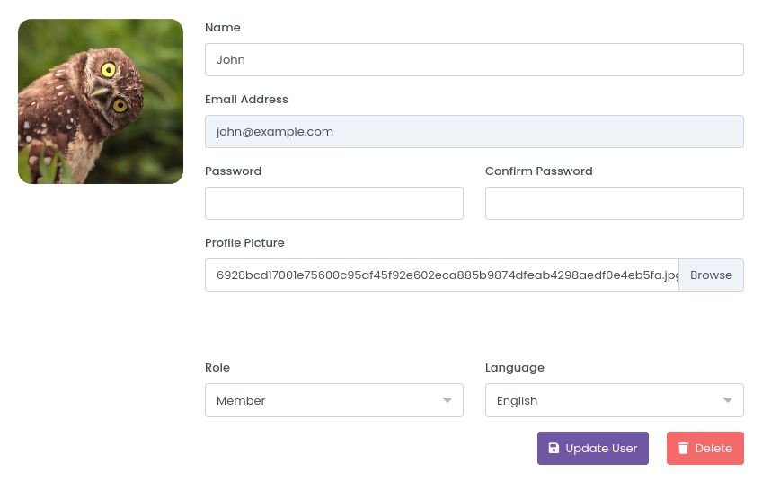
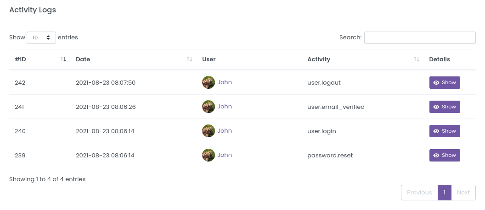

# Users

StrixEye Dashboard supports powerful users and permission system. You can create multiple users and permission levels.

You can see all Users on the [Users](https://dashboard.strixeye.com/users){:target="_blank"} page.

## Create User

You can create a new User in [User Create page](https://dashboard.strixeye.com/users/create/){:target="_blank"}

After sending the invitation, new user  first reset the password and then verify the e-mail.

## User Details

### Edit User

Users itself or admins can edit users. User's name, password, profile picture, role and language changable.

If you delete a user, you won't be able to revert this! **Be careful when deleting a user!**

### Activity Logs

You can see the User actions in the Activity Logs table.

