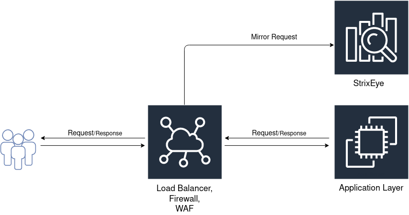

# Getting Started

If you have beta access to StrixEye, you can start with this section.

## Configure Dashboard
You can access dashboard from [dashboard.strixeye.com](dashboard.strixeye.com). 

### Create your domains

Firstly, you must add your domains that want to analyze with StrixEye. Select `Domains > Create New Domain` from sidebar and create your domains.


Domains are not editable, so if you make a mistake while creating a domain, you should delete and re-create it.

### Create an agent

Before the install agent to server, you must create an agent from Dashboard. Select `Agent > Create New Agent` from sidebar.


Give a name and select domains that you want to analyzing with the new agent. Each agent must have minimum one domain. You can add multiple domains to a agent.


## Install agent to your server

To install StrixEye Agent, you need docker and docker-compose.

You can download StrixEye Cli from [GitHub](https://github.com/strixeyecom/cli/releases).

```bash
sudo ./strixeye agent install --interactive
```

You need your user api token and your agent id. You can access your api token in [Dashboard > Profile](https://dashboard.usestrix.com/settings/profile) page and agent id in agent detail page.


If you get an error, visit the CLI troubleshooting page.


After agent installation, reload daemon and start **strixeyed**.
```bash
sudo systemctl daemon-reload
sudo systemctl start strixeyed
sudo systemctl enable strixeyed
```

This may takes several minutes. If everythink is okay, you will see agent statistics on agent detail page and dashboard.


## Mirror Requests

StrixEye is outside of the request response cycle. You must mirror all requests to your application to StrixEye. You can do this in your load balancer, WAF or firewall.



For example, you can access Nginx Mirror documentation [here.](https://nginx.org/en/docs/http/ngx_http_mirror_module.html) 

!!! Warning "Mirror Request Headers"
    You need to add two headers to mirrored requests.

    * X-FORWARDED-FOR
    * X-FORWARDED-PORT

    For Nginx, you can add like this
    ```conf
        proxy_set_header X-Forwarded-For  $proxy_add_x_forwarded_for;;
	    proxy_set_header X-Forwarded-Port  $server_port;
    ```

If everything is OK, you can see agent statistics on agent detail page or dashboard.


We configured Dashboard, installed agent and mirrored requests to agent. Now, agent starts autamtically detect suspects and suspicions. If you don't know what is suspect and suspicion, you can read Suspect and Suspicion page.

## Trigger and Integration

When a suspect detected, you can get an action manually, but this is useless. For this, we developed Trigger and Integration mechanisms. Basically, triggers are set of rules. Integrations are actions when a trigger is triggered. For example, you create an email integration, and you create a trigger rule. When a suspect detected and this trigger triggered, you get an email about this suspect.

### Integration

To create an integration, go to ``Integrations > Create New Integration``


Then, select an integration type. **Incident Response** integrations are active integrations. For example, when a suspect detected, AWS WAF integration can automatically ban this suspect.

**Notification** integrations are pasive integrations. For example, when a suspect detected, Email integration send an email.


When an integration created, you must verify it. Visit the integration detail page and click the **Integrate** button. 


If successfully integrated, you can start using it. 


### Trigger

To create a trigger, go to ``Triggers > Create New Trigger``


Then, set a trigger rule and select an integration. 


